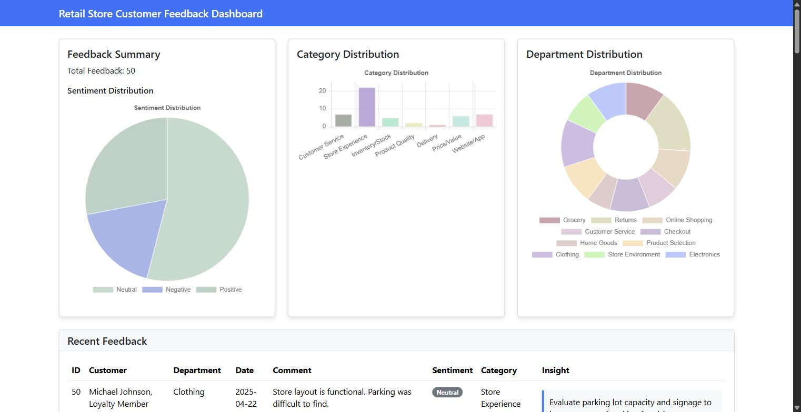
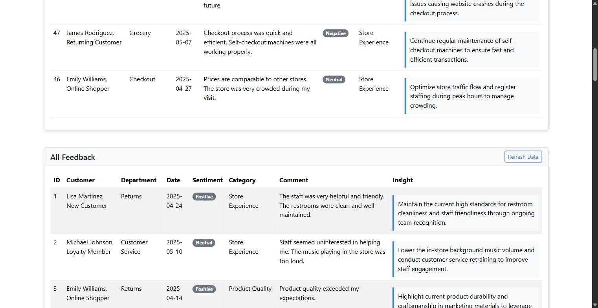

# Feedback Service: AI Insights Dashboard (Part B)

Spring Boot application that reads the sentiment analysis output from Part A, sends each
customer comment to Google Gemini for categorization and an actionable recommendation, and
serves a dashboard with the results: sentiment, category and department distributions, plus
every entry with the insight the model produced.

Part B of the final project for *Generative AI for Java and Spring Development*. It consumes
`sentiment_feedback_output.txt`, produced by
[customer-service-platform](https://github.com/abelsilvaeng/customer-service-platform).

## Requirements

- JDK 21 or later
- A Gemini API key, free at [aistudio.google.com/apikey](https://aistudio.google.com/apikey)
- No Maven install needed, the wrapper is committed

## Running it

```bash
export GEMINI_API_KEY=your-key          # bash
$env:GEMINI_API_KEY = "your-key"        # PowerShell

./mvnw clean package
java -jar target/feedback-service-0.0.1-SNAPSHOT.jar
```

Then open <http://localhost:8080>.

The first page load sends the fifty entries to Gemini in five batches of ten and blocks until
they finish, which takes about twenty seconds. After that the results are cached in memory for
the life of the process, so subsequent loads are instant. Restarting the app clears the cache.





## Endpoints

| Path | Returns |
|---|---|
| `/` | Thymeleaf dashboard with three Chart.js charts and two tables |
| `/getfeedback` | The full enhanced feedback list as JSON |

## How it works

`FeedbackService` reads everything after the `## Detailed Feedback Entries` marker in the Part A
output, splits it on blank lines, and pulls each field out with a regex. For every entry it
builds a prompt asking Gemini to pick one of eight fixed categories and write one actionable
recommendation, returned as JSON. `GeminiService` owns the HTTP call. `FeedbackController` does
nothing but hand the summary to the view.

## Four things changed from the lab instructions

**The API key comes from the environment, not `application.properties`.** The lab says to paste
the key into the properties file. That file is committed, so on a public repository the key
leaks the moment you push, and it contradicts what the course's own quiz teaches about managing
credentials. Here `application.properties` reads `${GEMINI_API_KEY:}` and the key never touches
the repo. It also travels in the `x-goog-api-key` header rather than as `?key=` in the URL,
which keeps it out of access logs and proxy history.

**The sentiment badge was invisible.** The stylesheet defines `.sentiment-POSITIVE`,
`.sentiment-NEUTRAL` and `.sentiment-NEGATIVE` in upper case, but Part A writes the CoreNLP
labels as `Positive`, `Neutral` and `Negative`. CSS class names are case sensitive, so
`th:classappend="${'sentiment-' + feedback.sentiment}"` produced `sentiment-Neutral`, which
matches no rule. A Bootstrap `.badge` with no background rule renders white text on white, so
the whole Sentiment column came out blank. This is visible in the lab's own reference
screenshot. `FeedbackEntry.getSentimentKey()` now normalises the label to upper case, the
template and the JavaScript both use it, and there is a fallback rule so an unrecognised
sentiment is grey rather than invisible.

**The model is `gemini-3.5-flash-lite`.** The lab pins `gemini-1.5-flash`, which is no longer
served to new API keys. `gemini-2.5-flash` is refused the same way: it appears in the model
listing, but calling it returns 404 with *"no longer available to new users"*. The model name
is a property, so it can be changed without touching code as this keeps moving.

**Entries go to Gemini in batches, not one call each.** This is the change that decides whether
the app works at all on the free tier, and it is worth spelling out.

The lab calls Gemini once per feedback entry, fifty times per dashboard load. Running that
produced a stream of HTTP 429s. The error body says why:

```
quotaId: GenerateRequestsPerDayPerProjectPerModel-FreeTier
limit: 20, model: gemini-3.6-flash
```

Twenty requests **per day**, per model, not the "approximately 60 queries per minute" the lab
promises. One call per entry cannot finish a single page load, ever, on a free key. It burns
the daily quota at entry twenty and the remaining thirty degrade silently to "Uncategorized",
which on the dashboard is indistinguishable from the model having nothing useful to say.

Batches of ten mean five calls for the whole file. Measured end to end: fifty entries enhanced
in 18.9 seconds, no throttling. `enhanceFeedback` is kept as the per-entry fallback for any id
the model omits from a batch answer, so a malformed response costs a few entries rather than
all of them.

Two smaller things in the same area. `GeminiService` retries a 429 with exponential backoff
rather than giving up on the first one. And `thinkingLevel` is set to `low`: Gemini 3.x reasons
before answering by default, which measured 2.9 s against 1.1 s per call on a task this
mechanical.

One more thing worth knowing: a 200 response from Gemini does not guarantee text. The
`candidates` array comes back empty when the prompt is blocked, and a candidate arrives with no
`parts` when generation stops early on a safety filter or the token limit. The lab's parsing
walks straight into `candidates[0].content.parts[0]`, which throws on those paths. Each level is
now checked, and the `finishReason` or `blockReason` is reported instead of a bare null.

## Credits

Built on the starter repository
[ibm-developer-skills-network/cbnjx-feedback-service](https://github.com/ibm-developer-skills-network/cbnjx-feedback-service)
for the IBM Developer Skills Network / SkillUp EdTech lab *Final Project Part B: Spring AI
Framework Implementation*.
